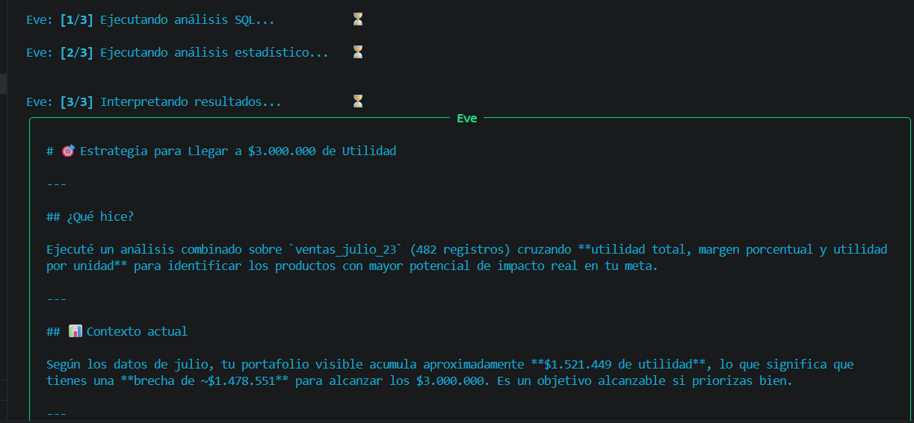
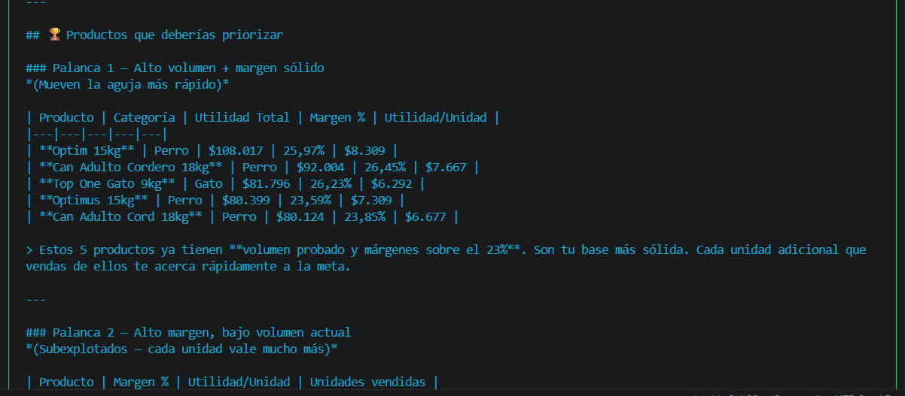
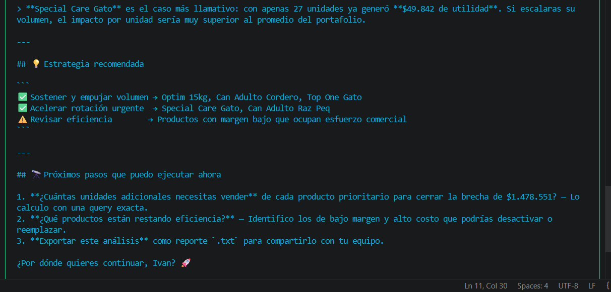

# 🤖 Eve — Conversational Data Explorer

> *"Load your data, ask in plain Spanish, get insights. That simple."*

Eve is a conversational multiagent AI system that allows data analysts to perform a **first exploration of structured data using natural language** — no SQL knowledge required.

Built with Python and the Anthropic API, Eve demonstrates how a well-designed multiagent architecture can turn complex data analysis into a natural conversation.

---

## 📸 Eve in Action

**Step 1 — Eve executes SQL, EDA and interprets results in sequence**



**Step 2 — Eve delivers prioritized product ranking with business context**



**Step 3 — Eve recommends a concrete commercial strategy and next steps**



> In this example, Eve analyzed 482 sales records, identified a $1,478,551 gap to a $3,000,000 utility goal, and recommended a prioritized product strategy — all from a single natural language question.

---

## 🎯 The Problem Eve Solves

Data analysts spend hours writing SQL queries just to answer basic business questions. Eve eliminates that friction:

- **Before Eve:** Open SQL client → write query → debug → interpret results → repeat
- **After Eve:** Ask in plain Spanish → get narrative insights → export executive memo

Eve is not a replacement for Power BI or Excel. It's the **first layer of intelligence** — the fastest path from raw data to "what's actually going on here."

---

## ✨ Key Features

- 🗣️ **Natural language to SQL** — Ask business questions, Eve generates and executes the query
- 📊 **Automatic EDA** — Descriptive statistics, Pearson correlations, IQR outlier detection
- 🧠 **Narrative insights** — Results explained in conversational Spanish, not technical output
- 🔗 **Multi-table analysis** — Automatic relationship detection via `_id` columns
- 📄 **Executive memo export** — Full analysis exported as `.txt` without truncation
- 🛡️ **5-layer guardrails** — Domain validation, SQL security, volume control, privacy detection
- 🧩 **Conversational context** — Remembers active filters, products, and numeric goals between turns
- 🇨🇱 **Chilean number format** — Handles `$1.234.567` format natively

---

## 🏗️ Architecture

Eve implements the **Hub and Spoke multiagent pattern** with a **Blackboard** for inter-agent communication.

```
                    ┌─────────────────┐
                    │   ORQUESTADOR   │  ← Hub Central
                    └────────┬────────┘
                             │
          ┌──────────────────┼──────────────────┐
          ▼                  ▼                  ▼
    ┌──────────┐      ┌──────────┐      ┌──────────┐
    │ Guardrail│      │ Agente   │      │ Agente   │
    │  5 capas │      │  Datos   │      │   SQL    │
    └──────────┘      └──────────┘      └──────────┘
          │                  │                  │
          └──────────────────┼──────────────────┘
                             ▼
                    ┌─────────────────┐
                    │   BLACKBOARD    │  ← Shared State
                    └─────────────────┘
```

### Agents

| Agent | Responsibility | Model |
|-------|---------------|-------|
| ORQUESTADOR | Coordinates agents, manages conversational context, exports narrative | Sonnet 4.6 |
| AGENTE_DATOS | Loads CSV/Excel, normalizes columns, generates enriched schema | No LLM |
| AGENTE_SQL | Translates natural language to SQL using enriched schema + context | Sonnet 4.6 |
| AGENTE_EDA | Descriptive statistics, correlations, outlier detection | No LLM (pandas) |
| AGENTE_INSIGHTS | Generates conversational narrative from real data | Sonnet 4.6 |
| AGENTE_LIMPIADOR | Normalizes Chilean number format, handles nulls | No LLM |
| AGENTE_ANONIMIZADOR | Detects and masks sensitive data | No LLM |

### Dual Model Strategy

- **Claude Haiku** → Guardrails, domain classification, intent detection *(fast, low cost)*
- **Claude Sonnet** → SQL generation, insights, final response *(quality where it matters)*

---

## 🔒 Security — 5-Layer Guardrails

1. **Domain classification** (Haiku) — Is this a data analysis question?
2. **SQL validation** (regex) — Blocks DROP, DELETE, EXEC, SQL injection
3. **API validation** (Haiku) — Confirms connection at startup
4. **Intent classifier** (Haiku) — Does this need full analysis or quick response?
5. **Volume control** (logic) — Warns and limits results > 10,000 rows

---

## 💡 Key Design Decisions

| Decision | Rationale |
|----------|-----------|
| Hub and Spoke pattern | Each agent has one responsibility — easier to debug and maintain |
| Blackboard for inter-agent communication | Agents stay decoupled — they don't call each other directly |
| Enriched schema passed to AGENTE_SQL | LLM knows column values and ranges — no more guessing with LIKE on product names |
| Export from Blackboard, never from chat history | Chat history has character limits — Blackboard stores the complete narrative |
| Session scope: one session = one problem | Respects context window limits — prevents context accumulation bugs |
| ETL before loading | Eve is a reader, not a data cleaner — preprocessing is the analyst's responsibility |

---

## 📋 What Eve Can and Cannot Do

### ✅ Can Do
- Load CSV (auto-detect encoding and separator) and Excel .xlsx
- Normalize Chilean number format ($1.234.567)
- Translate natural language to SQL SELECT with JOINs (up to 2 tables)
- Apply categorical filters using the correct column
- Distinguish between margin % and absolute profit $
- Maintain filters and context between turns in the same session
- Calculate daily rhythm needed to reach a utility goal
- Export complete executive memo as .txt

### ❌ Cannot Do
- Generate charts or visualizations → use Power BI
- Machine learning or predictions
- Modify data (read-only system)
- Conversations longer than 7-8 turns with complex accumulated context
- JOINs across 3+ tables simultaneously

---

## 🧠 Key Learnings from Building Eve

Building Eve was as much a learning journey as a technical project:

> **The context window is the scarcest resource in an agent.** The API doesn't inherit Claude.ai's context management — you build it from scratch.

> **One agent, one responsibility.** An agent trying to do everything ends up doing nothing well.

> **One session, one problem.** Design sessions around the context window, not around user expectations.

> **ETL before loading.** No agent, however intelligent, can compensate for bad data.

> **Honesty over capability inflation.** The best agent is the one that admits what it can't do.

---

## 🛠️ Tech Stack

| Technology | Purpose |
|-----------|---------|
| Python 3.10+ | Core language |
| Anthropic API | Claude Haiku + Sonnet models |
| SQLite | Local data storage (read-only) |
| pandas | EDA, statistics, DataFrames |
| openpyxl | Excel file reading |
| rich | Terminal UI (panels, colors, progress) |
| python-dotenv | Environment variable management |

---

## 📁 Project Structure

```
eve/
├── main.py                    # Entry point, chatbox, session management
├── blackboard.py              # Centralized shared state (Singleton)
├── guardrails.py              # 5-layer security and validation
├── config.py                  # Model configuration (Haiku/Sonnet/Opus)
├── logger.py                  # Structured logging system
│
├── agentes/
│   ├── orquestador.py         # Hub: coordination, context, export
│   ├── agente_datos.py        # Data ingestion + enriched schema
│   ├── agente_sql.py          # Natural language → SQL
│   ├── agente_eda.py          # Statistical analysis
│   ├── agente_insights.py     # Conversational narrative
│   ├── agente_limpiador.py    # Data normalization
│   └── agente_anonimizador.py # Privacy protection
│
├── herramientas/
│   ├── db_tools.py            # SQLite operations
│   └── reporte_tools.py       # .txt export
│
└── datos/
    ├── base.db                # SQLite (cleared on startup)
    └── memoria.json           # Last 20 conversations (persistent)
```

---

## 🗺️ Roadmap v2.0

- [ ] Automated test suite
- [ ] SQL query suggestions for Power BI export
- [ ] Persistent sessions across restarts (PostgreSQL)
- [ ] `.exe` compilation via PyInstaller for portable deployment
- [ ] Adaptive memory — Eve learns from usage patterns

---

## 👨‍💻 About the Author

**Ivan Jarpa**
AI Agent Designer | Business Intelligence & AI Integration | MBA

I design conversational AI agents that bridge business analytics and artificial intelligence. Eve is my first complete multiagent system — built from scratch while learning agent architecture, context window management, and the real constraints of LLM-based systems.

My background combines MBA-level business understanding with hands-on data skills (SQL, Power BI, Python) and AI system design. I believe the most valuable AI Engineers are those who understand both sides: the business problem and the technical solution.

📌 [LinkedIn](https://linkedin.com/in/biexcel)

---

## 📄 Documentation

- [Technical Design Document](./docs/EVE_Technical_Design_Document_v1.0.docx)

---

*Eve v1.0 — June 2026 — ~4,450 lines of Python — 7 specialized agents*
